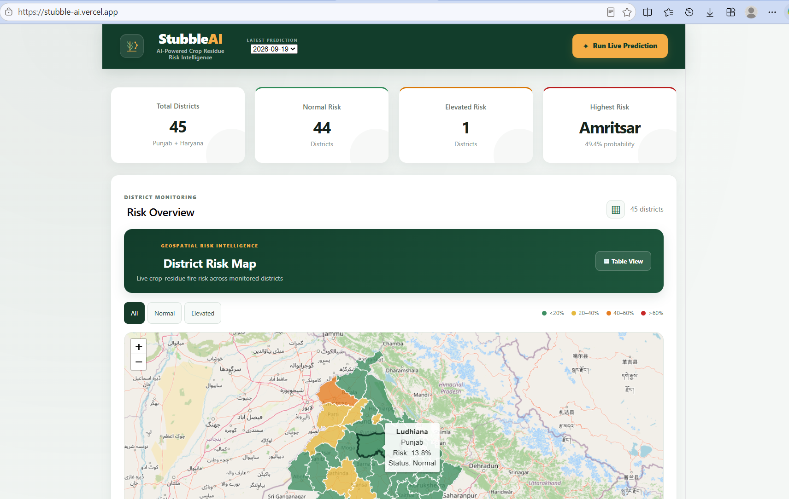

# 🌾 StubbleAI
### Multi-Horizon Forecasting of Crop-Residue Fire Risk Using Satellite Active-Fire Observations and Weather Data


**StubbleAI is an environmental AI research and decision-support project investigating whether satellite-observed active-fire activity, weather conditions, and temporal patterns can help forecast elevated fire activity across Punjab and Haryana, India.**

The project combines a historical data pipeline, temporal feature engineering, machine-learning benchmarks, multi-horizon forecasting experiments, model evaluation, and an interactive district-level dashboard.

**Live demo:** https://stubble-ai.vercel.app  
**GitHub:** https://github.com/Vansh-codi/StubbleAI

> **Research distinction:** The system forecasts satellite-derived active-fire activity. It does not establish that every detection is a confirmed crop-residue-burning event.

---

## Table of Contents

1. [Research Overview](#1-research-overview)
2. [Problem Statement](#2-problem-statement)
3. [Project Evolution](#3-project-evolution)
4. [V2 Research Dataset](#4-v2-research-dataset)
5. [Forecasting Task](#5-forecasting-task)
6. [Feature Engineering](#6-feature-engineering)
7. [Experimental Protocol](#7-experimental-protocol)
8. [Model Benchmarking](#8-model-benchmarking)
9. [Research Experiments: V2.3–V2.7](#9-research-experiments-v23v27)
10. [Error and Transition Analysis](#10-error-and-transition-analysis)
11. [Dataset Auditing](#11-dataset-auditing)
12. [Results and Interpretation](#12-results-and-interpretation)
13. [System Architecture](#13-system-architecture)
14. [Web Application](#14-web-application)
15. [Technology Stack](#15-technology-stack)
16. [Repository Structure](#16-repository-structure)
17. [Local Setup](#17-local-setup)
18. [Reproducibility and Research Integrity](#18-reproducibility-and-research-integrity)
19. [Limitations](#19-limitations)
20. [V3: Future Research](#20-v3-future-research)
21. [Sustainability Alignment](#21-sustainability-alignment)
22. [Author](#22-author)

---

## 1. Research Overview

### Research question

Can historical satellite-observed active-fire activity, weather variables, seasonality, and district characteristics help predict elevated activity at multiple future time horizons?

### Study area

- Punjab and Haryana, India
- 45 districts
- October–November seasonal period
- Historical observations covering 2023, 2024, and 2025

### Research focus

The V2 research programme investigates:

- Multi-horizon fire-activity forecasting
- Temporal feature engineering
- Chronological model evaluation
- Supervised learning versus persistence
- Spatial and temporal model extensions
- Cost-sensitive and transition-aware approaches
- District-level error patterns
- Reproducible dataset and benchmark auditing

The goal is not merely to produce a high-performing model. It is to determine which approaches provide useful forecasting information under a clearly defined evaluation protocol.

## 2. Problem Statement

Crop-residue burning is an important seasonal environmental concern in northern India. Satellite active-fire observations offer a way to monitor fire activity, but observations alone do not explain how activity may evolve over the following days.

StubbleAI investigates whether machine learning can estimate the probability of elevated future active-fire activity at district level.

Potential applications include environmental monitoring, research, situational awareness, and planning sustainable residue-management outreach.

## 3. Project Evolution

### V1 — Initial system

Established the foundational data-processing pipeline, machine-learning workflow, backend, and district-level dashboard.

### V2 — Research and benchmarking

Introduced a more systematic research workflow with:

- Historical district-level fire and weather data
- Five forecast horizons
- Chronological training, validation, and testing
- Multiple supervised learning models
- Persistence and climatology baselines
- Dataset audits
- Error and transition analysis
- Versioned experimental investigations

The V2 research state is preserved separately from future model development.

### V2.3–V2.7 — Experimental investigation

Several extensions were investigated to determine whether more complex learning strategies justified replacing or augmenting the reference model. The outcomes and limitations of these experiments are documented below.

### V3 — Next development phase

V3 is intended to build on the evidence from V2. It will be developed separately, with improvements accepted only when supported by reproducible evaluation.

## 4. V2 Research Dataset

| Component | Description |
|---|---|
| Study area | Punjab and Haryana |
| District coverage | 45 districts |
| Fire-panel dataset | 8,235 rows |
| Modelling dataset | 5,400 rows × 51 columns |
| Historical period | October–November, 2023–2025 |
| Satellite source | NASA FIRMS VIIRS observations |
| Weather source | NASA POWER historical weather |
| Forecast horizons | +1, +2, +3, +5, +7 days |

The fire panel contains aggregated district-level fire observations. The modelling dataset combines the fire panel with weather information and derived temporal features.

### Satellite observations

The documented fire-processing workflow uses VIIRS observations from NOAA-20 and Suomi-NPP products.

Fire-related variables include:

- Fire detection counts
- Fire radiative power (FRP)
- Detection confidence
- Day/night indicators
- Brightness-related variables

### Weather variables

Historical meteorological variables include:

- `T2M` — temperature
- `RH2M` — relative humidity
- `WS2M` — wind speed
- `PRECTOTCORR` — corrected precipitation

The live application may use a different operational weather feed. Historical research results must therefore be distinguished from live prediction outputs.

## 5. Forecasting Task

V2 evaluates five future horizons:

| Horizon | Forecast target |
|---|---|
| +1 day | Fire activity one day ahead |
| +2 days | Fire activity two days ahead |
| +3 days | Fire activity three days ahead |
| +5 days | Fire activity five days ahead |
| +7 days | Fire activity seven days ahead |

### Binary target

The experimental elevated-activity definition is:

```text
Normal:
future_fire_count <= 2

Elevated:
future_fire_count > 2
```

The threshold defines the study's classification target. It should not be interpreted as an official fire-danger category or a validated threshold for confirmed stubble burning.

## 6. Feature Engineering

The modelling pipeline uses temporal, meteorological, and geographic predictors.

### Historical fire features

- Fire-count lags
- FRP lags
- Multiple historical lag intervals
- Rolling fire-activity summaries based on prior observations

### Weather features

- Temperature
- Relative humidity
- Wind speed
- Precipitation

### Temporal features

- Calendar and seasonal features
- Sine/cosine representations of seasonality

### Geographic features

- State
- District

The dataset-building pipeline checks temporal alignment between lagged observations and future targets. Feature and target columns are treated separately to reduce the risk of future-information leakage.

## 7. Experimental Protocol

The primary evaluation uses chronological data splits.

```text
2023                     2024                      2025
TRAINING  ─────────────> VALIDATION ─────────────> HELD-OUT TEST
Fit models                Select thresholds         Evaluate models
```

The intended protocol is:

1. Fit supervised models on the 2023 training data.
2. Use 2024 validation data for model-threshold selection.
3. Freeze the selected thresholds before the 2025 test.
4. Evaluate the final models on the held-out 2025 observations.
5. Compare supervised approaches against simple baselines.
6. Conduct additional diagnostic experiments without silently replacing the original benchmark.

The same experimental protocol must be applied consistently when comparing models. Any change to target construction, sample selection, or evaluation rows must be explicitly documented.

## 8. Model Benchmarking

### Supervised models

The documented V2 benchmark includes:

| Model | Role |
|---|---|
| Logistic Regression | Linear classification baseline |
| Random Forest | Reference supervised model |
| XGBoost | Gradient-boosted tree model |
| LightGBM | Gradient-boosted tree model |

### Baseline models

**Persistence baseline**

Carries forward the latest observed fire activity as a prediction of future activity.

**Global climatology**

Uses historical overall activity patterns as a simple reference.

**District climatology**

Uses historical district-level patterns as a reference.

These baselines help determine whether the supervised models add useful information beyond persistence and historical averages.

### Evaluation metrics

The benchmark records metrics including:

- Accuracy
- Precision
- Recall
- F1 score
- ROC-AUC
- PR-AUC
- Confusion-matrix counts
- MAE for applicable fire-count predictions

Threshold-dependent metrics must be interpreted using the threshold-selection protocol. ROC-AUC and PR-AUC provide complementary information about model ranking.

## 9. Research Experiments: V2.3–V2.7

The following table summarises the experimental history provided for the project. The labels describe the recorded research outcomes; detailed quantitative claims should be taken from the corresponding experiment artifacts.

| Version | Research direction | Recorded outcome |
|---|---|---|
| V2.3 Trend | Trend-based extension | Rejected |
| V2.3 Spatial | Spatial extension | Conditionally accepted as experimental |
| V2.4 | Spatio-temporal interaction experiment | Rejected |
| V2.5 | Cost-sensitive learning | Rejected |
| V2.6 | Transition-aware modelling | Informative, but not accepted as the replacement |
| V2.7 | XGBoost/LightGBM learner benchmark | Rejected as replacements for the reference model |

### V2.3 — Trend and spatial experiments

The trend experiment was not accepted as an improvement to the reference approach.

The spatial experiment was retained conditionally as an experimental direction, rather than presented as a confirmed superior model.

### V2.4 — Spatio-temporal interaction

This experiment investigated whether a more explicit combination of spatial and temporal information would improve the forecasting approach.

The approach was rejected as a replacement under the recorded evaluation.

### V2.5 — Cost-sensitive learning

This experiment investigated whether changing the learning objective to account for different classification errors would produce a more useful model.

It was not accepted as a replacement. Any future reconsideration should be justified by clearly defined operational costs and evaluation evidence.

### V2.6 — Transition-aware modelling

This experiment investigated changes between activity states, including transitions involving normal and elevated activity.

The analysis was considered informative, but the approach was not accepted as the new reference model.

### V2.7 — Alternative learners

XGBoost and LightGBM were investigated as alternative supervised learners.

They were not accepted as replacements for the reference model under the recorded benchmark decisions.

### Why document rejected experiments?

Research is not only a record of the best-performing model. Documenting unsuccessful experiments helps establish:

- Which approaches were investigated
- Which methods were not accepted
- Why a more complex approach should not automatically be preferred
- What should be tested differently in future research

The experiments should be described as completed only to the extent supported by their recorded scripts, outputs, and reports.

## 10. Error and Transition Analysis

The research record includes a reported collection of 9,000 horizon-level predictions and additional diagnostic investigations.

Documented analysis dimensions include:

- District-level and state-level performance
- Punjab versus Haryana
- Early-, middle-, and late-season behaviour
- Current fire-activity regime
- Normal-to-elevated transitions
- Elevated-to-elevated transitions
- Random Forest versus persistence
- False-positive and false-negative cases

These diagnostics help investigate where a forecasting model succeeds or fails, rather than relying on a single aggregate metric.

A subgroup difference should not automatically be interpreted as a causal geographic effect. Results also depend on sample size, prevalence, seasonality, and the evaluation design.

## 11. Dataset Auditing

The V2 dataset audit examines several structural and temporal properties.

| Audit area | Purpose |
|---|---|
| Lag alignment | Check that lag features refer to the intended prior dates |
| Target alignment | Check future targets against their intended dates |
| Leakage checks | Inspect feature/target separation |
| Temporal boundaries | Examine date and year consistency |
| Geographic consistency | Check district/state relationships |
| Temporal coverage | Inspect daily coverage and usable observations |
| Target distributions | Characterise elevated versus normal target frequency |
| Persistence calculation | Compute reference baseline metrics |

The documented audit reported a passing result for its defined checks.

This is evidence about the checks performed, not proof that every possible leakage risk has been ruled out or that all benchmark metrics have been independently reproduced.

## 12. Results and Interpretation

Random Forest is the reference supervised model in the documented V2 benchmark. The project also records alternative learners, simple baselines, thresholds, confusion matrices, and horizon-specific evaluation metrics.

The following reported Random Forest F1 scores are available in the frozen benchmark summary:

| Horizon | Random Forest F1 |
|---|---:|
| +1 day | 0.7754 |
| +2 days | 0.7513 |
| +3 days | 0.7305 |
| +5 days | 0.7303 |
| +7 days | 0.7085 |

These are reported benchmark values and should be checked against the final per-horizon artifacts before publication.

### Important baseline-verification note

The research record also contains persistence results that differ from those produced by a later dataset-audit calculation. The final README and paper should use a single reconciled set of baseline results calculated on the same test rows and targets.

Until that reconciliation is complete, the README does not claim that Random Forest definitively outperforms persistence at every horizon.

The research objective is to establish whether machine learning adds reproducible predictive value, not to maximise the apparent performance of one model.

## 13. System Architecture

```text
NASA FIRMS Satellite Observations
                +
     Historical Weather Data
                |
                v
        Data Processing
                |
                v
   District-Level Fire Panel
                |
                v
      Feature Engineering
                |
                v
  Multi-Horizon ML Experiments
                |
                v
      Evaluation and Auditing
                |
                v
      Prediction Interface
                |
                v
       FastAPI + React
                |
                v
   District Map and Analysis
```

The historical research pipeline and operational dashboard serve different purposes. The research pipeline supports controlled evaluation; the application presents predictions and supporting information using its configured data sources.

## 14. Web Application

The existing prototype provides district-level environmental information through an interactive dashboard.

Documented interface features include:

- District-level prediction summaries
- Search and filtering
- Risk probability displays
- Interactive district map
- District-level analysis
- Weather and recent fire-activity information
- Prediction tracking and model-performance information

The live application should be understood as a decision-support prototype, not as proof of real-world forecasting accuracy.

### Screenshots

Add screenshots from the current repository if available:

```text
docs/screenshots/dashboard-overview.png
docs/screenshots/risk-table.png
docs/screenshots/district-analysis.png
```

Example:

```markdown

```

## 15. Technology Stack

| Area | Technologies |
|---|---|
| Programming | Python, JavaScript |
| Data processing | Pandas, NumPy |
| Machine learning | scikit-learn, XGBoost, LightGBM |
| Backend | FastAPI, Uvicorn |
| Frontend | React, Vite |
| Mapping | Leaflet, React Leaflet |
| Satellite data | NASA FIRMS VIIRS |
| Historical weather | NASA POWER |
| Operational weather | Open-Meteo |
| Model persistence | Joblib |
| Version control | Git, GitHub |
| Deployment | Vercel and configured backend hosting |

## 16. Repository Structure

The following is a representative structure. Update it to match the actual repository before publication.

```text
StubbleAI/
├── backend/
├── frontend/
├── model/
├── scripts/
│   └── v2/
│       ├── build_ml_dataset_v2.py
│       ├── train_v2_models.py
│       ├── evaluate_v2_baselines.py
│       └── audit_ml_dataset_v2.py
├── research/
│   └── v2/
│       ├── BENCHMARK_SUMMARY.md
│       └── ...
├── docs/
│   └── screenshots/
├── requirements.txt
├── .env.example
├── .gitignore
└── README.md
```

The research scripts, frozen benchmark artifacts, and future V3 development should remain distinguishable.

### Recorded experimental checkpoints

The research history provided includes these Git checkpoints:

| Commit | Experiment |
|---|---|
| `57855c9` | V2.7 learner benchmark |
| `82bf4ae` | V2.6 transition diagnostics |
| `2d67f84` | V2.5 cost-sensitive experiment |
| `92bc80e` | V2.4 spatio-temporal interaction experiment |

These abbreviated hashes are reproduced from the supplied project record. Verify them against the repository before using them as permanent links.

## 17. Local Setup

### Prerequisites

- Python 3.10 or a compatible supported Python version
- Node.js and npm
- Git

### Clone the repository

```bash
git clone https://github.com/Vansh-codi/StubbleAI.git
cd StubbleAI
```

### Create the Python environment

Windows PowerShell:

```powershell
python -m venv .venv
.\.venv\Scripts\Activate.ps1
pip install -r requirements.txt
```

### Configure environment variables

Use `.env.example` to identify the required environment variables. Create a local `.env` file only for credentials needed by the selected components.

Never commit production secrets or private API keys.

### Start the backend

If the backend entry point remains `backend/main.py`:

```powershell
cd backend
uvicorn main:app --reload
```

Default local API address:

```text
http://127.0.0.1:8000
```

### Start the frontend

Open another terminal:

```powershell
cd frontend
npm install
npm run dev
```

The Vite development server commonly uses:

```text
http://localhost:5173
```

Confirm the actual paths, dependencies, and environment-variable requirements in the current repository.

## 18. Reproducibility and Research Integrity

The project follows a research-first principle: model claims should be traceable to the data, code, evaluation protocol, and recorded outputs that support them.

Key practices include:

- Chronological training, validation, and test splits
- Validation-based threshold selection
- Separation of future targets from predictors
- Explicit baseline comparisons
- Dataset alignment and consistency checks
- Documentation of experimental alternatives
- Preservation of the V2 research state
- Separate development and evaluation of future versions

A model should not be declared superior solely because its result is numerically higher in one experiment. Comparisons must use consistent targets, evaluation rows, and metrics.

## 19. Limitations

- Satellite detections are proxies for fire activity, not confirmed crop-residue-burning events.
- The geographic scope is limited to Punjab and Haryana.
- The study focuses on October–November.
- Binary classification simplifies a more complex environmental process.
- District-level aggregation can hide local variation.
- Historical and operational weather sources may differ.
- Persistence can be a strong baseline.
- Audit results cover only the checks implemented.
- Historical test performance does not guarantee future operational performance.
- Pollution reduction, emissions impact, and health benefits have not been established by an intervention study.

## 20. V3: Future Research

V3 will build on the V2 experimental record without overwriting the frozen research baseline.

Planned directions include:

1. Improved temporal modelling and feature engineering.
2. Further evaluation of spatial and spatio-temporal information.
3. Better analysis of activity-state transitions.
4. Probability calibration and uncertainty assessment.
5. Robustness evaluation across districts, seasons, and forecast horizons.
6. Consistent comparisons against persistence and climatology baselines.
7. Evaluation using only information available at the intended prediction time.
8. Monitoring predictions against subsequently available observations.

These are future research directions, not completed features or guaranteed improvements. A V3 method should replace the reference model only if its results justify that decision under a reproducible evaluation protocol.

## 21. Sustainability Alignment

**Primary alignment: SDG 13 — Climate Action**

StubbleAI investigates environmental monitoring and decision support around seasonal active-fire activity.

Related areas include:

- **SDG 3 — Good Health and Well-being:** relevance to environmental and air-quality research.
- **SDG 11 — Sustainable Cities and Communities:** regional environmental monitoring and preparedness.

The project does not claim a measured reduction in pollution, emissions, or health impacts. These outcomes require separate evidence and impact evaluation.


## Disclaimer

StubbleAI is an educational and research-oriented decision-support prototype. Its predictions estimate satellite-derived active-fire activity and do not independently confirm crop-residue burning.

The system should not be used as the sole basis for enforcement, penalties, or decisions affecting individuals or communities.

> **Project philosophy:** Investigate rigorously. Compare fairly. Document failures. Preserve evidence. Improve only when results justify it.
